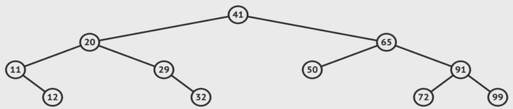
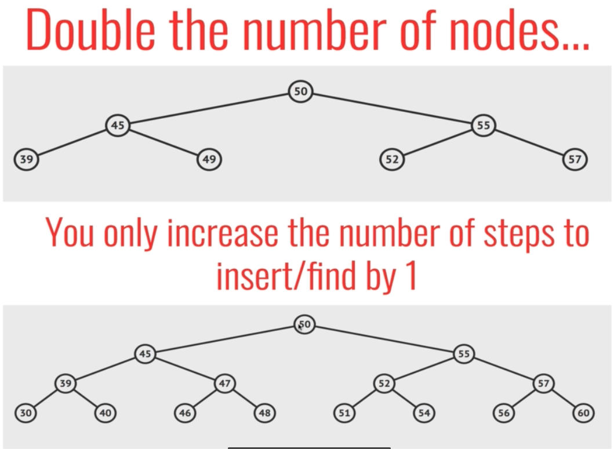
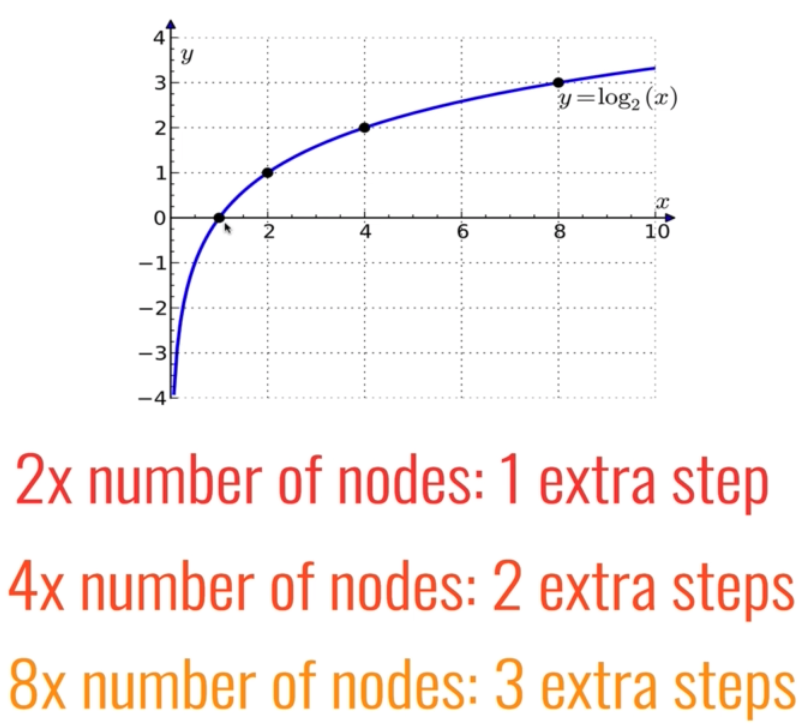
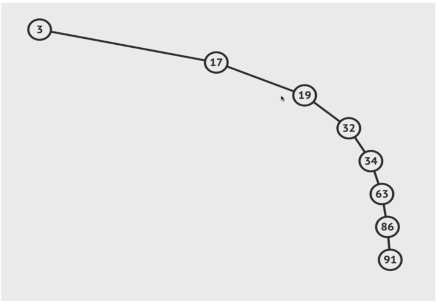

## Binary Search Tree (BST)

`BST` is a special type of Binary Tree (`max 2 children` as well) which is sorted in particular way:

- every node `to the left` of a `parent` node is always `less` than the parent
- every node `to the right` of a `parent` node is always `greater` than the parent

#### Big O

- `insertion` - O(log n), but not guaranteed in worst case
- `searching` - O(log n), but not guaranteed in worst case

#### Worst case O(n)

