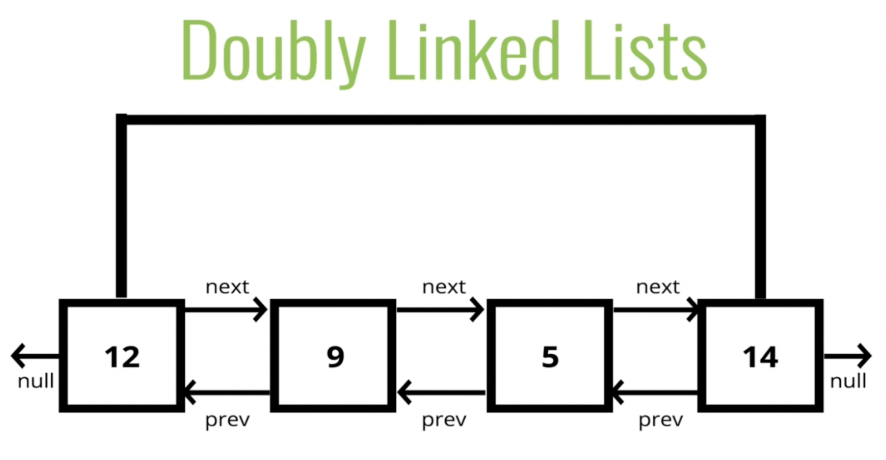

## Doubly Linked Lists (DLL)

It's almost identical to SLL, except every node has `another` pointer to the `previous` node. Better than SLL for finding nodes and can be done in half the time, but do take up more memory considering the extra pointer.

#### Big O

- `insertion` - O(1)
- `removal` - O(1)
- `searching` - O(n)
- `access` - O(n)
