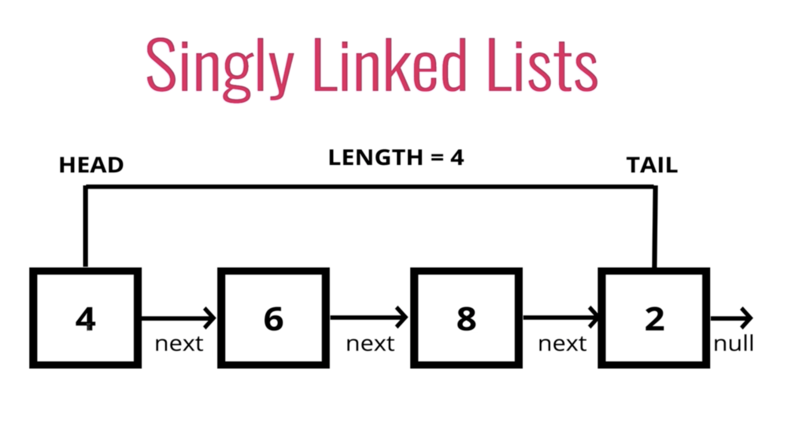

## Singly Linked Lists (SLL)
A `Linked List` is a data structure that contains a `head` (first item), `tail` (last item) and `length` property.

Linked Lists consist of `nodes`, and each node has a `value` and `pointer` to another node or null. 



So it's just a bunch on nodes pointing to other nodes (one node points the `next` one).
##### Comparison with array
SLL
````
- don't have indexes
- connected via nodes with a next pointer
- random access is not allowed
````
Array
````
- indexed in order
- insertion and deletion can be expensive
- quick access by index
````