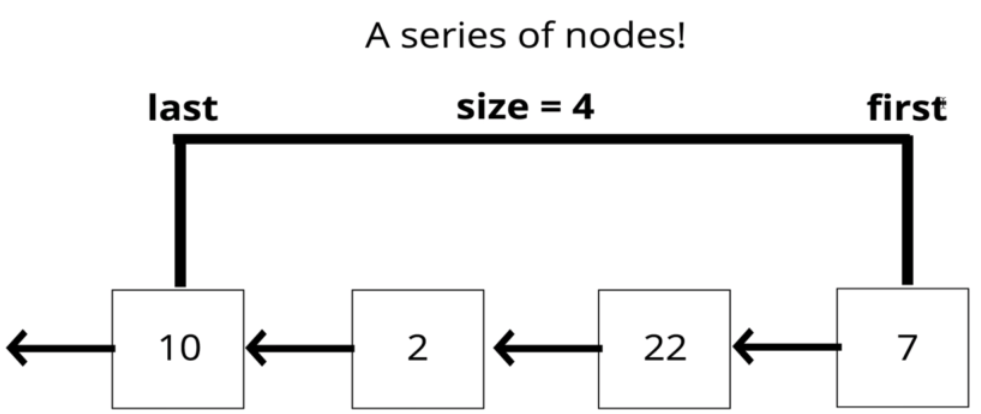

## Stack

It's a `LIFO`* data structure. The last element added to the stack will be the first element removed from stack.
*last in first out

#### Big O

- `insertion` - O(1)
- `removal` - O(1)
- `searching` - O(n)
- `access` - O(n)
