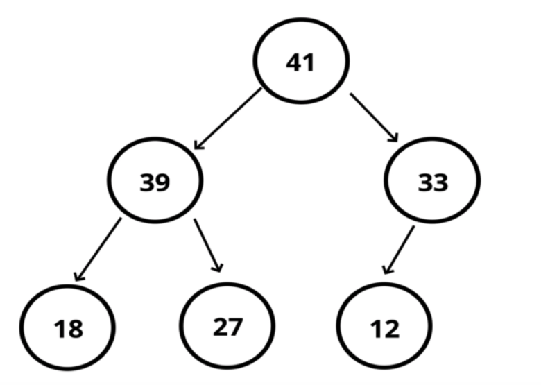
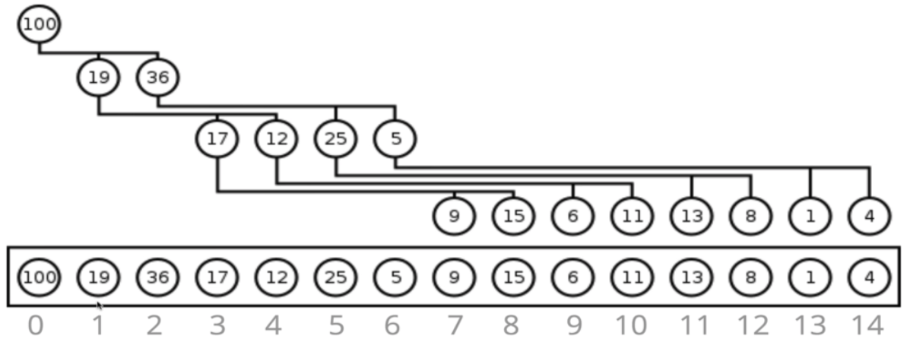

## Binary Heap (BH)

`BH` is very similar to Binary Search Tree, but with some different rules:

- in a `Max BH`, `parent` nodes are alwayes `larger` than `child` nodes
- in a `Min BH`, `parent` nodes are always `smaller` than `child` nodes
- `no order` to the `left` and `right`
- `left` children are `filled` out `first`

`BH` are used to implement `Priority Queues` and, sometimes, are used with `graph traversal` algos.

#### Max BH

- each parent has at most two child nodes
- the `value` of each `parent` node is `always greater` than it's `child` nodes, but `no guarantees` between `sibling` nodes

#### Min BH

- `the only difference` from `Max BH` is that `parent` node is always `smaller` than it's `child` nodes

#### Storing Max BH in array

- the `left` child is stored at `2n + 1`, the right at `2n + 2`, where `n` - index of an array
- the `parent` is stored at index `(n - 1) / 2` (floored), where `n` - index of a child

#### Big O

- `insertion` - O(log n)
- `removing` - O(log n)
- `searching` - O(n), because not ordered like BST, for example.
