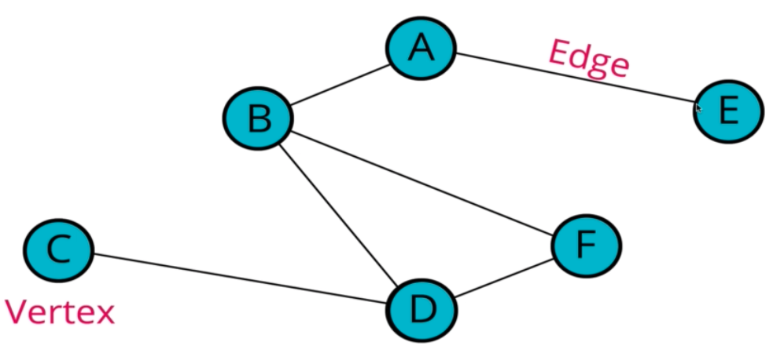
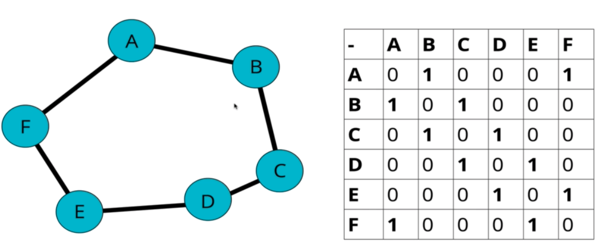
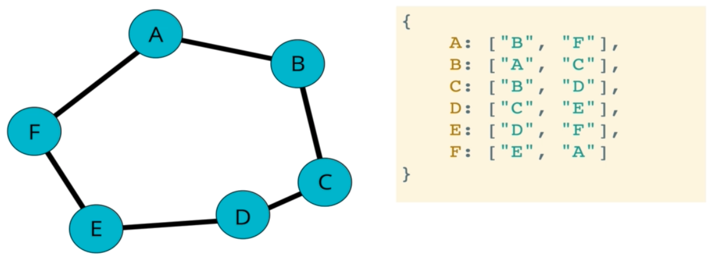
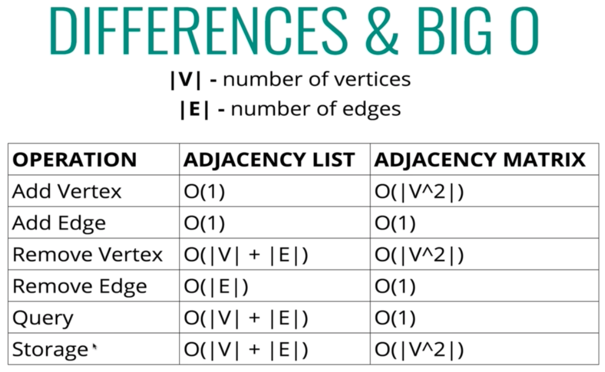
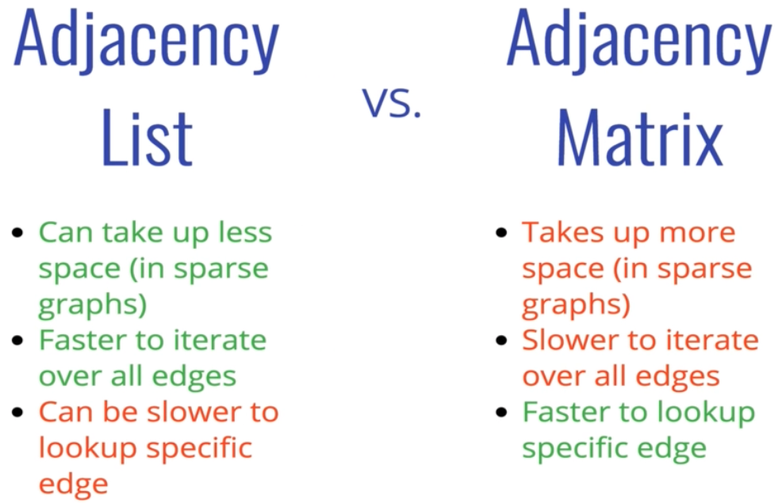

## Graph

A type of tree that consists of nodes (`vertex`) and connections (`edge`)

#### Types of Graph

- `directed`: connection assigned to the edge (could point one way or both ways)
- `undirected`: no one way connectionn (point both ways)
- `weighted`: each connection has a value assosiated with it
- `unweighted`: each connection has no value assosiated with it

#### Approaches

- adjacency matrix

- adjacency list

#### Big O

